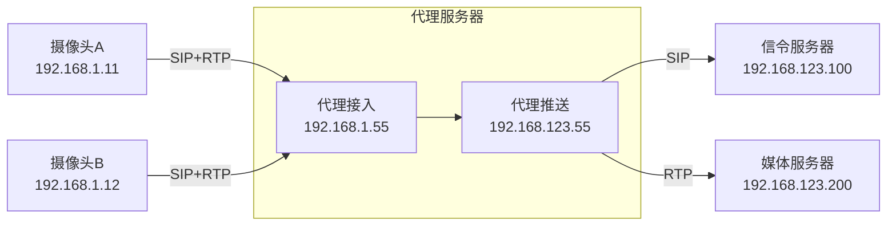

# gb28181-proxy

## 说明
### 本项目解决跨网络GB28181协议代理转发和视频流转发


## 配置
```json
{
  "serverIp": "192.168.123.100",
  "serverPort": 5060,
  "serverProtocol": "tcp",
  "clientIp": "192.168.123.55",
  "clientPort": 5060,
  "proxyIp": "192.168.1.55",
  "proxySipPort": 5060,
  "proxyMediaPort": 5678
}
```

## 网络
